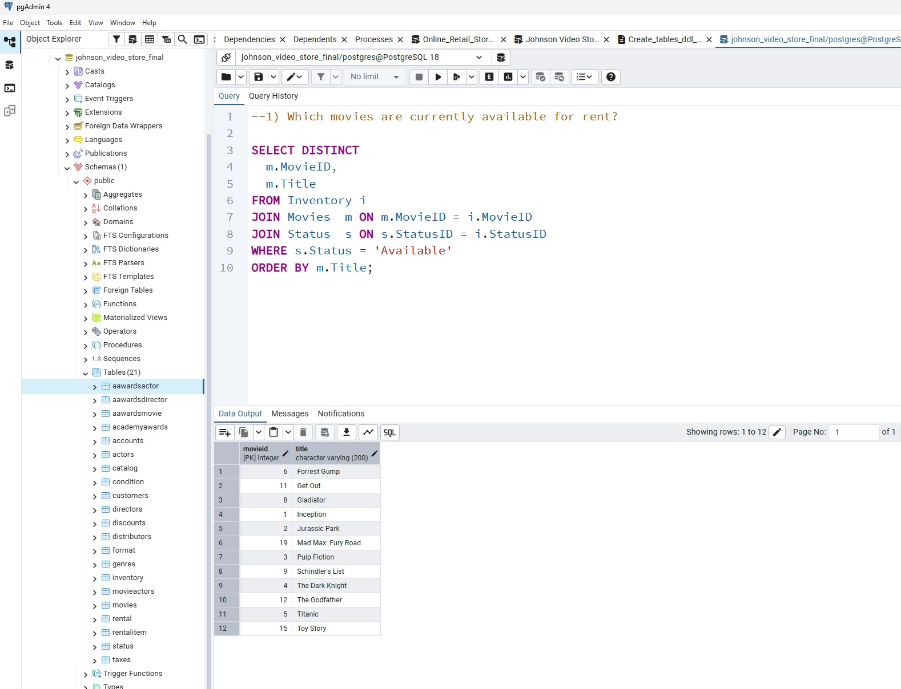

# Video Store Database

## Overview
This project demonstrates the design and implementation of a relational database for a video rental business using PostgreSQL. It includes schema design, data population, and business-focused SQL queries used to analyze store operations.

## Tech Stack
- PostgreSQL
- SQL (DDL and DML)
- Relational database design

## Database Design
The database was designed to support:
- customer management
- movie inventory tracking
- rental transactions
- fee tracking (late, damage, rewind)
- business analytics queries

## Project Structure
- `/SQL` – table creation and data seeding scripts  
- `/Queries` – business-driven SQL queries  
- `/ERD` – entity relationship diagram  
- `/Data_Dictionary` – field definitions and metadata  
- `/Documentation` – project proposal  
- `/Screenshots` – query results and execution  

## Example Query

Which movies are currently available for rent?

```sql
SELECT DISTINCT
    m.movieid,
    m.title
FROM inventory i
JOIN movies m ON i.movieid = m.movieid
JOIN status s ON i.statusid = s.statusid
WHERE s.status = 'Available'
ORDER BY m.title;

## Example Output


